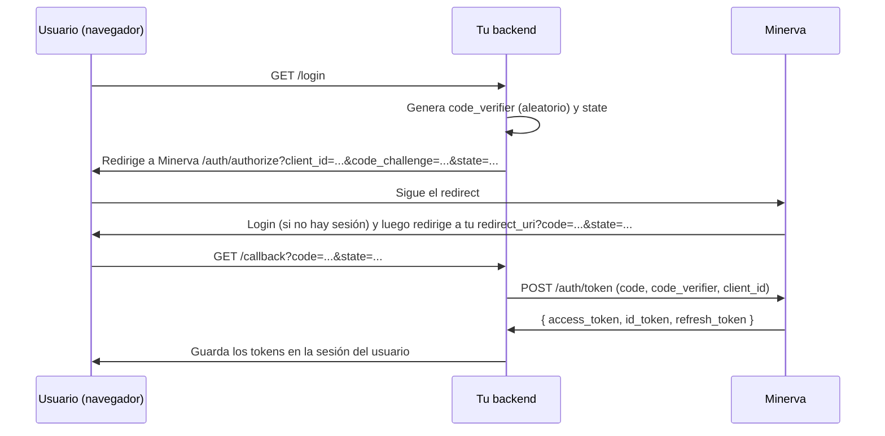

# Guía de integración: cómo conectar tu sistema a Minerva

Esta guía es para equipos que quieren delegar login y autorización a Minerva. Si algún
término no es familiar, revisa primero [`glosario.md`](glosario.md).

## Resumen del contrato

1. Registras tu aplicación en Minerva (`client_id`, redirect URI, cliente público o
   confidencial).
2. Declaras tus permisos y roles en un `manifest.minerva.yml`.
3. Tu frontend redirige el login a Minerva (`/auth/authorize`).
4. Tu backend canjea el código por tokens (`/auth/token`) y valida cada request con el
   SDK (`minerva_sdk`), que verifica la firma RS256 contra el JWKS de Minerva y consulta
   permisos en tiempo real — **nunca validas roles localmente**.

## 1. Registrar tu aplicación

### Opción A: vía API (sesión de administrador)

```bash
curl -X POST http://localhost:9000/applications \
  -H "Authorization: Bearer <admin_token>" \
  -H "Content-Type: application/json" \
  -d '{"name": "Godín", "slug": "godin", "is_public": true}'
```

- `is_public: true` → cliente público (SPA/móvil sin backend que pueda guardar un
  secreto): la respuesta no incluye `client_secret_hash` y el canje de token exige PKCE.
- `is_public: false` (default) → cliente confidencial: Minerva genera y devuelve un
  `client_secret` (guárdalo de inmediato, no se vuelve a mostrar).

Registra la(s) redirect URI(s) exactas:

```bash
curl -X POST http://localhost:9000/applications/{application_id}/redirect-uris \
  -H "Authorization: Bearer <admin_token>" \
  -H "Content-Type: application/json" \
  -d '{"uri": "http://localhost:8100/callback", "environment": "development"}'
```

Minerva rechaza cualquier `redirect_uri` en `/auth/authorize` que no coincida
exactamente con una registrada (evita *open redirect*). Registra una entrada por
entorno (`development`, `production`).

### Opción B: vía manifiesto (recomendado si ya vas a declarar permisos)

Si subes un `manifest.minerva.yml` con `application.code` nuevo, Minerva crea la
aplicación automáticamente al importarlo (ver sección 2) y devuelve el `client_id`/
`client_secret` generados en la respuesta del import. Las redirect URIs declaradas en
`application.redirect_uris` también se registran.

## 2. Declarar permisos y roles (`manifest.minerva.yml`)

Convención de permisos: **`{application_code}.{resource}.{action}`**, con `action` una
de `view, create, update, delete, assign, approve, authorize, export, import, manage`.

```yaml
application:
  code: godin                          # slug único, minúsculas/números/guion_bajo
  name: Godín
  description: Gestor de oficios y solicitudes
  base_url: http://localhost:8000
  redirect_uris:
    - http://localhost:8000/auth/callback

permissions:
  - key: godin.oficios.view
    name: Ver oficios
    description: Permite consultar oficios
  - key: godin.oficios.create
    name: Crear oficios

roles:
  - name: Consulta
    description: Solo lectura
    permissions:
      - godin.oficios.view
  - name: Capturista
    permissions:
      - godin.oficios.view
      - godin.oficios.create
```

Validaciones que aplica Minerva al importar (`backend/app/modules/devkit/manifest.py`):
- `application.code` obligatorio, formato `^[a-z0-9_]+$`.
- Cada `permissions[].key` debe matchear `^[a-z0-9_]+\.[a-z0-9_]+\.[a-z0-9_]+$` **y**
  empezar con `{application.code}.` — no puedes declarar permisos de otra aplicación.
- Cada permiso listado en `roles[].permissions` debe existir en `permissions` del mismo
  manifiesto.

**Idempotencia:** reimportar el mismo manifiesto (o una versión actualizada) hace
*upsert* — actualiza nombres/descripciones, agrega permisos/roles nuevos, nunca borra ni
regenera secrets de una aplicación ya existente.

### Cómo importarlo

**Automático al arrancar Minerva (dev):** coloca el archivo en `manifests/` con alguno
de estos nombres/patrones: `*.minerva.yml`, `*.minerva.yaml`, `manifest.yml`,
`manifest.yaml`. Si `MINERVA_AUTO_IMPORT_MANIFESTS=true` (default en dev), se importa en
cada arranque del backend.

**Manual, vía API:**

```bash
curl -X POST http://localhost:9000/api/v1/manifests/import \
  -H "Authorization: Bearer <admin_token>" \
  -F "file=@manifest.minerva.yml"
```

## 3. Flujo OIDC: Authorization Code + PKCE



### 3.1 Iniciar el login (tu frontend → Minerva)

```
GET {MINERVA_ISSUER}/auth/authorize
    ?client_id={tu client_id}
    &redirect_uri={tu redirect_uri registrada}
    &response_type=code
    &scope=openid profile email
    &state={valor aleatorio, verificas que vuelva igual}
    &code_challenge={BASE64URL(SHA256(code_verifier))}   # obligatorio si cliente público
    &code_challenge_method=S256
    &nonce={opcional, anti-replay del id_token}
```

Parámetros adicionales soportados (OIDC Core 3.1.2.1):
- `prompt=none` → si no hay sesión, Minerva responde `error=login_required` en lugar de
  mostrar login (útil para *silent renew* en iframes).
- `prompt=login` → fuerza re-autenticación aunque haya sesión.
- `max_age={segundos}` → fuerza re-autenticación si la sesión es más vieja que ese valor.

### 3.2 Canjear el código (tu backend → Minerva, servidor-a-servidor)

```bash
curl -X POST {MINERVA_ISSUER}/auth/token \
  -H "Content-Type: application/x-www-form-urlencoded" \
  -d "grant_type=authorization_code" \
  -d "client_id={tu client_id}" \
  -d "code={code recibido}" \
  -d "redirect_uri={misma redirect_uri}" \
  -d "code_verifier={el verifier original}" \
  -d "client_secret={solo si tu cliente es confidencial}"
```

Respuesta:

```json
{
  "access_token": "eyJhbGciOiJSUzI1NiIs...",
  "id_token": "eyJhbGciOiJSUzI1NiIs...",
  "refresh_token": "...",
  "token_type": "bearer",
  "expires_in": 900
}
```

### 3.3 Refrescar el access token

```bash
curl -X POST {MINERVA_ISSUER}/auth/token \
  -d "grant_type=refresh_token" \
  -d "client_id={tu client_id}" \
  -d "refresh_token={el refresh_token actual}"
```

El refresh token devuelto en la respuesta **reemplaza** al anterior (rotación): guarda
siempre el más reciente. Si reutilizas uno ya rotado, Minerva revoca toda la familia de
tokens — trátalo como de un solo uso.

### 3.4 Cerrar sesión / revocar (RFC 7009)

```bash
curl -X POST {MINERVA_ISSUER}/auth/revoke \
  -d "client_id={tu client_id}" \
  -d "token={refresh_token a revocar}"
```

## 4. Validar tokens y permisos con el SDK (`minerva_sdk`)

```bash
pip install -e path/to/minerva/sdk   # o como dependencia publicada, según tu setup
```

Variables de entorno del SDK (`minerva_sdk/config.py`):

| Variable | Para qué |
|---|---|
| `MINERVA_ISSUER_URL` | URL base de Minerva (de donde se descarga el JWKS) |
| `MINERVA_APPLICATION_CODE` | tu `application_code` — se usa para verificar `aud` y para consultar `/me/permissions` |
| `MINERVA_EXPECTED_ISSUER` | (opcional) valida `iss` exacto del token |
| `MINERVA_VERIFY_AUD` | si `true` (default), exige que `aud` coincida con tu `application_code` |
| `MINERVA_JWKS_CACHE_TTL` | segundos de caché del JWKS (default 3600) |
| `MINERVA_PERMISSIONS_CACHE_TTL` | segundos de caché de permisos por usuario (default 300) |

```python
from fastapi import Depends, FastAPI
from minerva_sdk.fastapi import get_current_user, require_permission

app = FastAPI()

@app.get("/whoami")
async def whoami(user: dict = Depends(get_current_user)):
    return {"sub": user["sub"], "email": user.get("email")}

@app.get("/oficios")
def crear_oficio(user: dict = Depends(require_permission("godin.oficios.create"))):
    ...
```

`require_permission` consulta `GET /api/v1/me/permissions?application={code}` en
Minerva (con el Bearer del usuario) en tiempo real, con una caché corta. Si Minerva
responde `401` (token revocado), el SDK propaga `401` a tu cliente; si el usuario no
tiene el permiso, responde `403`.

**Nunca** valides permisos comparando `roles` localmente — el contrato es: el SDK
pregunta a Minerva, Minerva decide.

## 5. Ejemplo de referencia completo

`examples/godin-consumer/` es un consumidor mínimo funcional: cliente público + PKCE,
`/login`, `/callback`, `/whoami` y `/protegido` (con `require_permission`). Su
`README.md` trae el flujo de prueba manual paso a paso, incluyendo los `curl` exactos
para registrar la aplicación y probar el endpoint protegido.

## 6. Diferencias entre Dev y Producción al integrar

| Aspecto | Dev | Producción |
|---|---|---|
| `MINERVA_ISSUER_URL` (en tu sistema) | `http://localhost:9000` | URL pública HTTPS de Minerva |
| Verificación de `aud`/`iss` | puede dejarse relajada para probar rápido | `MINERVA_VERIFY_AUD=true` y `MINERVA_EXPECTED_ISSUER` fijado |
| Registro de `redirect_uri` | localhost, puertos de desarrollo | dominio real de tu sistema, HTTPS |
| Manifiesto | auto-importado al arrancar Minerva en local | importar explícitamente vía API/CI en el despliegue, no depender de auto-import |
| Secrets (`client_secret`) | puede vivir en `.env` local | secret manager — nunca en el repo ni en logs |

Ver [`despliegue.md`](despliegue.md) para cómo se endurece Minerva mismo en producción.
